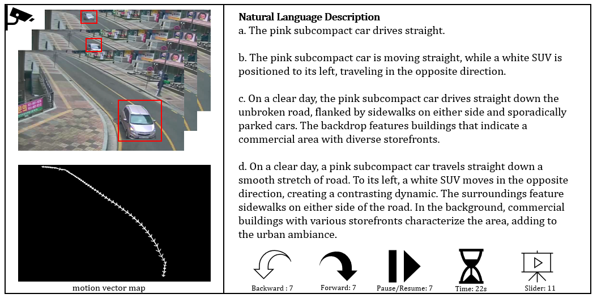

# NAVI Challenge 2025
The NAVI-Challenge, hosted at AVSS 2025, offers a new benchmark dataset that is larger and more fine-grained than existing ones, specifically designed to foster the development of robust VTR (Video-Text Retrieval) models(particular focus on text-based vehicle retrieval) for future cities.

<br>

## NAVI Dataset
<div style="width: 100%; text-align: center;">
  
</div>

<br>

The NAVI Dataset follows the basic structure of the CITYFLOW-NL Dataset, but extends it by incorporating vehicle CCTV video from multiple countries such as India and South Korea. It further enhances the dataset by providing bounding boxes for each vehicle, trajectory maps, and four diverse natural language descriptions per vehicle. Each description is composed of a combination of elements, including the main vehicle’s color, type, and movement; the surrounding vehicles’ color, type, and their relationship to the main vehicle; as well as the background captured by the CCTV camera.

<br>

**USA Video Sample**

<p align="center">
  
</p>


**INDONESIA Video Sample**

<p align="center">
  
</p>


**KOREA Video Sample**

<p align="center">
  
</p>


## News
*  **2025.04.15**: Released code

## Requirement

*   [PyTorch](https://pytorch.org/ "PyTorch") version = 1.7.1

*   Install other libraries via

```bash
pip install -r requirements.txt
```

## How to Run
(1) About setting data directory
```
data_navi
├── data
│   ├── test-queries.json 
│   ├── test-tracks.json
│   ├── train-tracks.json
├── navi
│   ├── input/
│   ├── json/
│   │   └── total-tracks.json
│   └── output/
```

(2) About preprocess data
```bash
cd preprocess
python preprocess_data.py
```

(3) About the running scripts

**Before running scripts, setting directory of data in scripts file.**
```bash
# Test
sh scripts/run_xclip_navi_vit16_test.sh

# Train
sh scripts/run_xclip_navi_vit16_train.sh
```

## Acknowledgments
In the original XCLIP, the text encoder has a maximum token length of 77, which was insufficient to accommodate the fine-grained and detailed descriptions in the NAVI Dataset. To address this, we increased the maximum token length of the text encoder to 256 and trained it from scratch. For the visual encoder, we fine-tuned the pretrained ViT-B/16 model to adapt it to our dataset.
